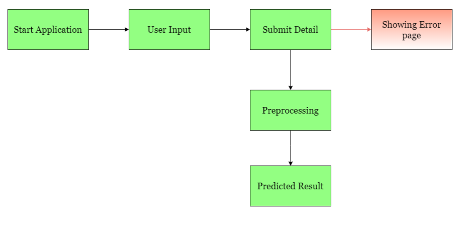

# Concrete Compressive Strength Predcition

The project has been developed to predict the compressive strength of concrete based on the quantity of it's mixture properties such as cement, water, fly ash, coarse aggregate, fine aggregate, superplasticizer, blast furnace and also the age of the concrete.

## Project description

The raw data has been analysed to understand the data and the relationship between the features .The data has been pre processed by checking null values, checking duplicates etc... The processed data is then scaled and then passed it for model training. The best model is fine tuned and is used for the prediction. A web app has been developed for this project where you can estimate the strength of the concrete. The app is deployed in Heroku.

## Dataset 

This dataset is part of the Kaggle and can be found [here](https://www.kaggle.com/datasets/elikplim/concrete-compressive-strength-data-set).The dataset is comprised of 1005 records The data is in structured format and stored in a CSV file.

The Dataset consists of 9 features listed below : 

* cement (quantitative) - kg in a m3 mixture 
* blast_furnace_slag (quantitative)  - kg in a m3 mixture
* fly_ash (quantitative) - kg in a m3 mixture
* water (quantitative) - kg in a m3 mixture
* superplasticizer (quantitative) - kg in a m3 mixture
* coarse_aggregate (quantitative) - kg in a m3 mixture
* fine_aggregate (quantitative) - kg in a m3 mixture
* age (quantitative) - Day (1~365)
* concrete_compressive_strength (quantitative) - MPa

## Tools Used

<a href="https://www.python.org" target="_blank">  </a>
<a href="https://www.docker.com/" target="_blank">  </a>
<a href="https://scikit-learn.org/" target="_blank">  </a>
<a href="https://pycaret.org/">  </a>
<a href="https://www.w3schools.com/css/" target="_blank"> </a>
<a href="https://flask.palletsprojects.com/" target="_blank">  </a> 
<a href="https://git-scm.com/" target="_blank">  </a> 
<a href="https://heroku.com" target="_blank">  </a> 
<a href="https://www.w3.org/html/" target="_blank"> </a>

## Project Architecture


## User Input/Workflow



## Docker Image

Docker image is also developed for this project and the image is pushed to docker hub. You can follow the below command to run the image.

```
docker pull techner3/concretestrength
```
```
docker run -p 5000:5000 -e PORT=5000 -t techner3/concretestrength
```